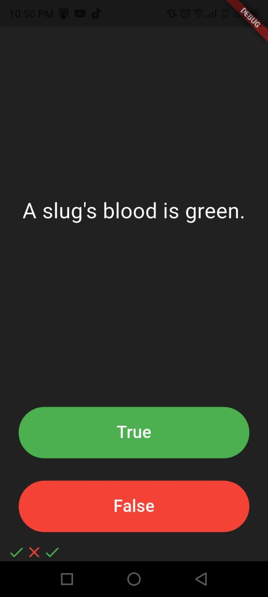
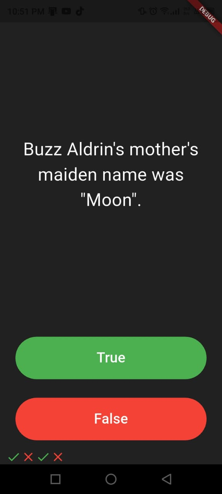
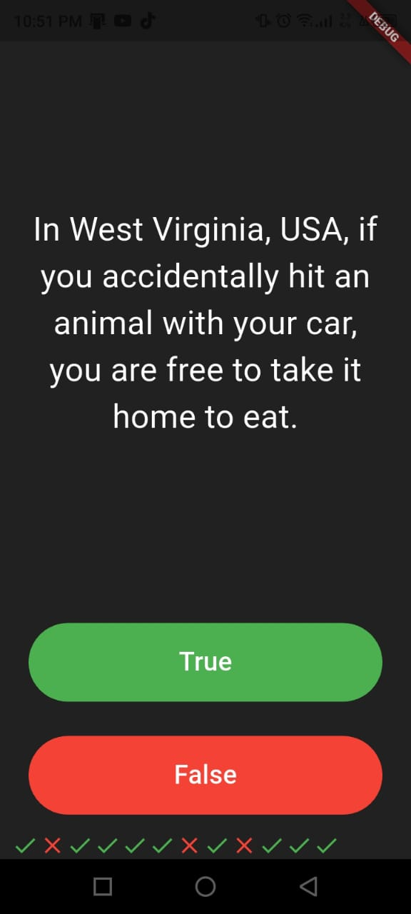
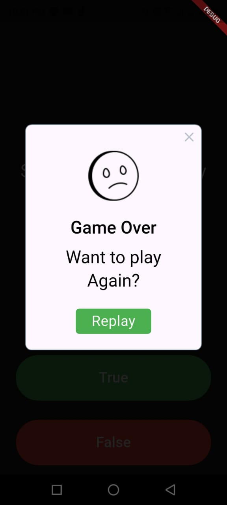

# 🧠 Quizzler – Flutter Quiz App

Quizzler is a simple **True / False quiz application** built with **Flutter**.  
The app displays a series of questions, lets the user answer them, and shows instant feedback using icons.  
At the end of the quiz, a dialog appears allowing the user to replay the game.

---

## ✨ Features

- ✅ True / False quiz questions  
- 🎯 Instant feedback with ✔️ and ❌ icons  
- 🔁 Restart quiz when finished  
- 🎨 Clean dark UI  
- 🚨 End-of-quiz alert dialog using `rflutter_alert`

---

## 📸 Screenshots

<p align="center">
  
  
  
  
  
</p>


---

## 🛠️ Technologies Used

- **Flutter**
- **Dart**
- **Material Design**
- **rflutter_alert** package

---

## 📂 Project Structure

```

lib/
│── main.dart
│── quiz_brain.dart
│── question.dart
assets/
│── images/
│   └── sad.png

````

---

## 🚀 Getting Started

### Prerequisites
- Flutter SDK installed
- Android Studio / VS Code
- An Android emulator or physical device

### Installation

1. Clone the repository:
```bash
   git clone https://github.com/GhBMpr/Quizler_flutter.git
````

2. Navigate to the project folder:

   ```bash
   cd Quizler_flutter
   ```

3. Get dependencies:

   ```bash
   flutter pub get
   ```

4. Run the app:

   ```bash
   flutter run
   ```

---

## 📦 Dependencies

```yaml
dependencies:
  flutter:
    sdk: flutter
  rflutter_alert: ^2.0.7
```

---

## 🧩 How It Works

* `QuizBrain` manages:

  * Questions list
  * Current question index
  * Answers checking
* `QuizPage` handles:

  * UI
  * User interactions
  * Score tracking
* At the last question:

  * An alert dialog is shown
  * The quiz resets automatically

---

## 🧠 Learning Outcomes

* State management with `setState`
* Custom Dart classes
* Working with lists and logic
* Using third-party Flutter packages
* UI layout with `Expanded` and `Column`

---

## 📌 Future Improvements

* Add a score counter
* Shuffle questions
* Add categories
* Add animations
* Store high scores

---

## 👨‍💻 Author

**Ghofrane**
Flutter & Mobile Development Student

---

## 📄 License

This project is open-source and free to use for learning purposes.

